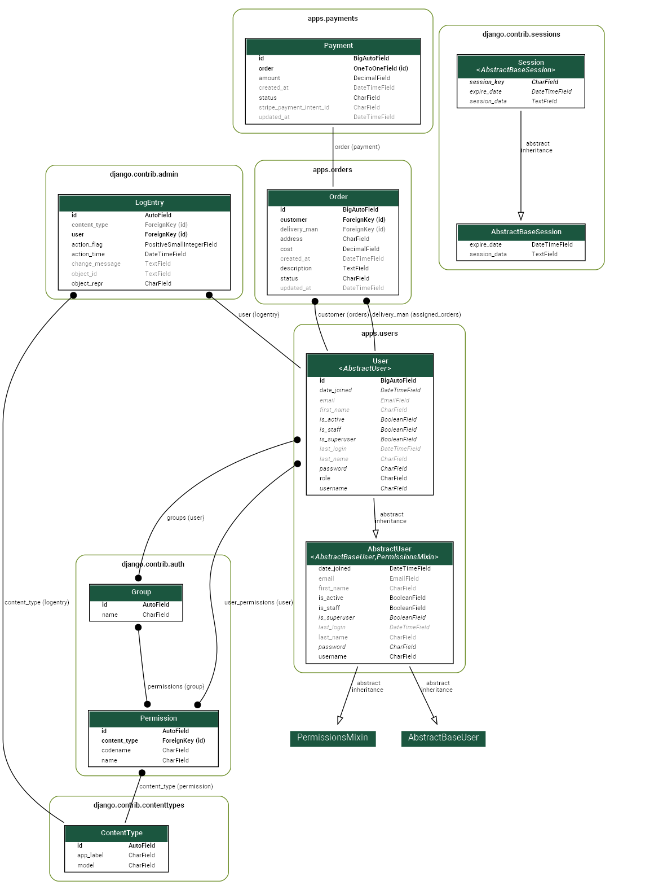
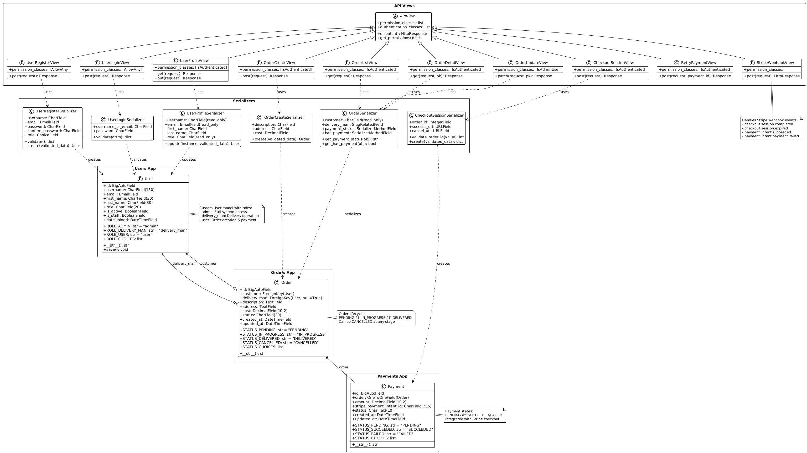

# 🚚 Courier Management System - Backend API

A comprehensive RESTful API for courier and delivery management, built with Django REST Framework. Features role-based access control, integrated Stripe payments, and complete order lifecycle management.

## 📄 Project Overview

This system provides a complete backend solution for courier services with:

- **Multi-role Authentication** (Admin, Delivery Personnel, Customers)
- **Order Management** with real-time status tracking
- **Integrated Stripe Payments** with webhook automation
- **Role-based Permissions** ensuring secure access
- **Comprehensive API Documentation** with Swagger UI
- **Payment Success/Cancel Pages** for seamless UX

## 🔗 Live Links

| Resource | URL |
|----------|-----|
| **🌐 Live API** | **https://courierapi.pythonanywhere.com** |
| **📖 API Documentation** | **https://courierapi.pythonanywhere.com/api/docs/** |
| **📋 Admin Panel** | **https://courierapi.pythonanywhere.com/admin/** |
| **📂 GitHub Repository** | **https://github.com/emhash/courier-api** |
| **📮 Postman Collection** | [Download JSON](./Courier_Management_API.postman_collection.json) |

## 🗄️ Database Schema



### Core Models
- **User**: Authentication with role-based access (admin, delivery_man, user)
- **Order**: Complete order lifecycle with customer assignment 
- **Payment**: Stripe integration for secure transactions



## 🔐 Login Credentials
| Role | Username | Password | Email |
|------|----------|----------|-------|
| **Super Admin** | `admin` | `admin` | admin@gmail.com |
| **Admin** | `ashiq` | `111111qqqqqq` | md.e.h.ashiq@gmail.com |
| **Delivery Man** | `rafiq` | `111111qqqqqq` | rafiq@gmail.com |
| **Customer** | `shafiq` | `111111qqqqqq` | shafiq@gmail.com |

## 🚀 Quick Start

### 1. Local Development Setup

```bash
# Clone repository
git clone https://github.com/emhash/courier-api.git
cd courier-api

# Create virtual environment
python -m venv venv
source venv/bin/activate  # On Windows: venv\Scripts\activate

# Install dependencies
pip install -r requirements.txt

# Environment setup (.env file)
SECRET_KEY=
DEBUG=True
STRIPE_SECRET_KEY=
STRIPE_WEBHOOK_SECRET=
FRONTEND_URL=

# Database setup
python manage.py migrate
python manage.py createsuperuser

# Run development server
python manage.py runserver
```

### 2. Access Points
- **API Documentation**: http://localhost:8000/api/docs/
- **Admin Panel**: http://localhost:8000/admin/
- **Homepage**: Redirects to API documentation

---

## 📚 API Documentation

### Base URL
- **Live**: `https://courierapi.pythonanywhere.com`
- **Local**: `http://localhost:8000`

All endpoints return standardized responses:

**Success Response Format:**
```json
{
    "success": true,
    "statusCode": 201,
    "message": "Operation completed successfully",
    "Data": { /* response data */ }
}
```

**Error Response Format:**
```json
{
    "success": false,
    "message": "Validation error occurred.",
    "errorDetails": {
        "field": "email",
        "message": "Invalid email format."
    }
}
```

---

## 🔑 Authentication Endpoints

### Register New User
**`POST /api/v1/auth/register/`**

```bash
curl --location 'https://courierapi.pythonanywhere.com/api/v1/auth/register/' \
--form 'email="newuser@gmail.com"' \
--form 'password="111111qqqqqq"' \
--form 'username="newuser"' \
--form 'confirm_password="111111qqqqqq"' \
--form 'role="user"'
```

**Response:**
```json
{
    "success": true,
    "statusCode": 201,
    "message": "User Registration successful",
    "Data": {
        "username": "newuser",
        "email": "newuser@gmail.com",
        "role": "user",
        "access": "eyJhbGciOiJIUzI1NiIsInR5cCI6IkpXVCJ9..."
    }
}
```

**Available Roles:** `admin`, `delivery_man`, `user`

### User Login
**`POST /api/v1/auth/login/`**

```bash
curl --location 'https://courierapi.pythonanywhere.com/api/v1/auth/login/' \
--form 'username_or_email="shafiq@gmail.com"' \
--form 'password="111111qqqqqq"'
```

**Response:**
```json
{
    "success": true,
    "statusCode": 200,
    "message": "Login successful",
    "Data": {
        "username": "shafiq",
        "email": "shafiq@gmail.com",
        "role": "user",
        "access": "eyJhbGciOiJIUzI1NiIsInR5cCI6IkpXVCJ9...",
        "refresh": "eyJhbGciOiJIUzI1NiIsInR5cCI6IkpXVCJ9..."
    }
}
```

### Get User Profile
**`GET /api/v1/auth/profile/`** *(Requires Authorization)*

```bash
curl --location 'https://courierapi.pythonanywhere.com/api/v1/auth/profile/' \
--header 'Authorization: Bearer YOUR_ACCESS_TOKEN'
```

### Update Profile
**`PUT /api/v1/auth/profile/`** *(Requires Authorization)*

```bash
curl --location --request PUT 'https://courierapi.pythonanywhere.com/api/v1/auth/profile/' \
--header 'Authorization: Bearer YOUR_ACCESS_TOKEN' \
--form 'first_name="John"' \
--form 'last_name="Doe"'
```

---

## 📦 Order Management Endpoints

### Create Order (Without Payment)
**`POST /api/v1/orders/create/`** *(Requires Authorization - User Role)*

```bash
curl --location 'https://courierapi.pythonanywhere.com/api/v1/orders/create/' \
--header 'Content-Type: application/json' \
--header 'Authorization: Bearer YOUR_ACCESS_TOKEN' \
--data '{
    "description": "Pickup documents from Gulshan office and deliver to Dhanmondi residence",
    "address": "House 45, Road 12A, Dhanmondi, Dhaka-1209",
    "cost": "250.00"
}'
```

**Response:**
```json
{
    "success": true,
    "statusCode": 201,
    "message": "Order created successfully",
    "Data": {
        "id": 4,
        "customer": "shafiq",
        "delivery_man": null,
        "payment_status": null,
        "has_payment": false,
        "description": "Pickup documents from Gulshan office and deliver to Dhanmondi residence",
        "address": "House 45, Road 12A, Dhanmondi, Dhaka-1209",
        "cost": "250.00",
        "status": "PENDING",
        "created_at": "2025-07-09T19:08:53.403473Z",
        "updated_at": "2025-07-09T19:08:53.403517Z"
    }
}
```

###  Create Order WITH Payment
**`POST /api/v1/orders/create/`** *(Single API Call)*

```bash
curl --location 'https://courierapi.pythonanywhere.com/api/v1/orders/create/' \
--header 'Content-Type: application/json' \
--header 'Authorization: Bearer YOUR_ACCESS_TOKEN' \
--data '{
    "description": "Pickup documents from office",
    "address": "House 45, Road 12A, Dhanmondi",
    "cost": "50.00",
    "create_payment": true
}'
```

**Response:**
```json
{
    "success": true,
    "statusCode": 201,
    "message": "Order created successfully. Redirect user to checkout_url to complete payment.",
    "Data": {
        "id": 5,
        "customer": "shafiq",
        "delivery_man": null,
        "payment_status": "PENDING",
        "has_payment": true,
        "description": "Pickup documents from office",
        "address": "House 45, Road 12A, Dhanmondi",
        "cost": "50.00",
        "status": "PENDING",
        "created_at": "2025-07-09T19:19:53.369943Z",
        "updated_at": "2025-07-09T19:19:53.370005Z",
        "checkout_url": "https://checkout.stripe.com/c/pay/cs_test_...",
        "session_id": "cs_test_..."
    }
}
```

**Key Features:**
- ✅ Single API call creates order + payment
- ✅ Returns Stripe checkout URL immediately  
- ✅ Automatic webhook handling for payment status
- ✅ Optional custom success/cancel URLs

### List Orders
**`GET /api/v1/orders/`** *(Role-based filtering)*

```bash
curl --location 'https://courierapi.pythonanywhere.com/api/v1/orders/' \
--header 'Authorization: Bearer YOUR_ACCESS_TOKEN'
```

**Access Control:**
- **Admin**: See all orders
- **Delivery Man**: See assigned orders only
- **User**: See own orders only

### Get Order Details
**`GET /api/v1/orders/{id}/`**

```bash
curl --location 'https://courierapi.pythonanywhere.com/api/v1/orders/4/' \
--header 'Authorization: Bearer YOUR_ACCESS_TOKEN'
```

### Update Order (Admin)
**`PATCH /api/v1/orders/{id}/update/`** *(Admin Only)*

```bash
curl --location --request PATCH 'https://courierapi.pythonanywhere.com/api/v1/orders/4/update/' \
--header 'Content-Type: application/json' \
--header 'Authorization: Bearer ADMIN_ACCESS_TOKEN' \
--data '{
    "delivery_man": "rafiq",
    "status": "PENDING",
    "description": "Get the delivery fast",
    "address": "Dhaka"
}'
```

**Response:**
```json
{
    "success": true,
    "statusCode": 200,
    "message": "Order updated successfully",
    "Data": {
        "id": 4,
        "customer": "shafiq",
        "delivery_man": "rafiq",
        "payment_status": "PENDING",
        "has_payment": true,
        "description": "Get the delivery fast",
        "address": "Dhaka",
        "cost": "250.00",
        "status": "PENDING",
        "created_at": "2025-07-09T19:08:53.403473Z",
        "updated_at": "2025-07-09T19:27:46.085245Z"
    }
}
```

### Update Order Status (Delivery Man)
**`PATCH /api/v1/orders/{id}/update/`** *(Delivery Man - Status Only)*

```bash
curl --location --request PATCH 'https://courierapi.pythonanywhere.com/api/v1/orders/5/update/' \
--header 'Content-Type: application/json' \
--header 'Authorization: Bearer DELIVERY_MAN_TOKEN' \
--data '{
    "status": "DELIVERED"
}'
```

**Response:**
```json
{
    "success": true,
    "statusCode": 200,
    "message": "Order status updated successfully",
    "Data": {
        "id": 5,
        "customer": "shafiq",
        "delivery_man": "rafiq",
        "payment_status": "SUCCEEDED",
        "has_payment": true,
        "description": "Pickup documents from office",
        "address": "House 45, Road 12A, Dhanmondi",
        "cost": "50.00",
        "status": "DELIVERED",
        "created_at": "2025-07-09T19:19:53.369943Z",
        "updated_at": "2025-07-09T19:31:57.707559Z"
    }
}
```

---

## 💳 Payment Integration

### Payment for Existing Order
**`POST /api/v1/payments/checkout/`** *(Create Stripe Checkout)*

```bash
curl --location 'https://courierapi.pythonanywhere.com/api/v1/payments/checkout/' \
--header 'Content-Type: application/json' \
--header 'Authorization: Bearer YOUR_ACCESS_TOKEN' \
--data '{
    "order_id": 4
}'
```

**Response:**
```json
{
    "success": true,
    "statusCode": 201,
    "message": "Checkout session created successfully. Redirect user to checkout_url",
    "Data": {
        "checkout_url": "https://checkout.stripe.com/c/pay/cs_test_...",
        "session_id": "cs_test_...",
        "order_id": 4,
        "amount": 250.0
    }
}
```

### Retry Failed Payment
**`POST /api/v1/payments/retry/{payment_id}/`**

```bash
curl --location 'https://courierapi.pythonanywhere.com/api/v1/payments/retry/1/' \
--header 'Content-Type: application/json' \
--header 'Authorization: Bearer YOUR_ACCESS_TOKEN'
```

### Stripe Webhook (Automatic)
**`POST /api/v1/payments/webhook/`** *(No Auth - Webhook Signature)*

This endpoint is automatically called by Stripe to update payment statuses. It handles:
- `checkout.session.completed` → Payment Success
- `checkout.session.expired` → Session Timeout  
- `payment_intent.succeeded` → Backup Confirmation
- `payment_intent.payment_failed` → Payment Failure

---

## 🎨 Payment UI Pages

### Success Page
**URL**: `https://courierapi.pythonanywhere.com/payment/success/`
- ✅ Payment confirmation display
- ✅ Session ID tracking
- ✅ Modern responsive design
- ✅ Automatic status updates

### Cancel Page  
**URL**: `https://courierapi.pythonanywhere.com/payment/cancel/`
- ❌ Payment cancellation handling
- 🔄 Retry payment functionality
- 📝 Order tracking via URL parameters
- 🎯 User-friendly error messaging

---

## 🔐 Role-Based Access Control

### Admin Permissions
- ✅ Manage all orders (create, read, update, delete)
- ✅ Assign delivery personnel to orders
- ✅ View all payments and transactions
- ✅ User management capabilities

### Delivery Man Permissions  
- ✅ View assigned orders only
- ✅ Update order status (PENDING → IN_PROGRESS → DELIVERED)
- ❌ Cannot modify order details or assign other delivery men
- ❌ Cannot access other users' orders

### User (Customer) Permissions
- ✅ Create new orders
- ✅ View own orders only
- ✅ Process payments for orders
- ✅ Retry failed payments
- ❌ Cannot access other users' data

---


## 📂 Project Structure

```
courier-api/
├── apps/
│   ├── users/          # Authentication & user management
│   ├── orders/         # Order CRUD operations
│   └── payments/       # Stripe integration
├── core/
│   ├── settings/       # Django configuration  
│   └── urls.py         # URL routing
├── templates/
│   └── payment/        # Success/cancel pages
├── static/             # Static files
├── requirements.txt    # Dependencies
└── README.md          # This file
```

---

## 🚀 Deployment

The API is deployed on **PythonAnywhere** with:
- ✅ SSL Certificate (HTTPS)
- ✅ Database persistence
- ✅ Environment variable security
- ✅ Stripe webhook endpoints
- ✅ Static file serving

**Live API**: https://courierapi.pythonanywhere.com

---

